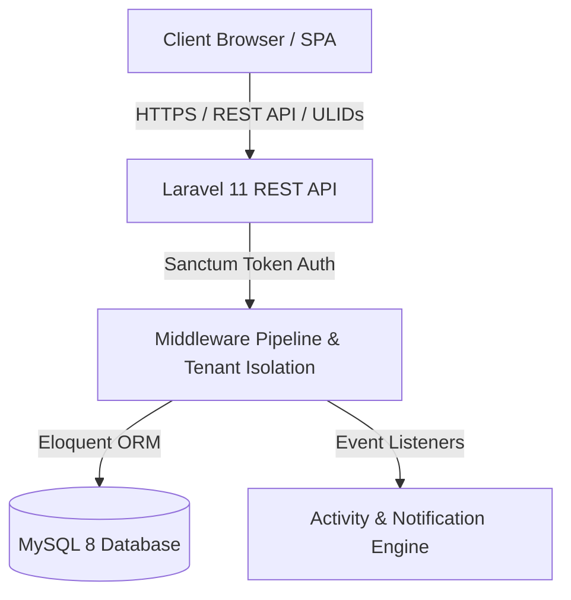
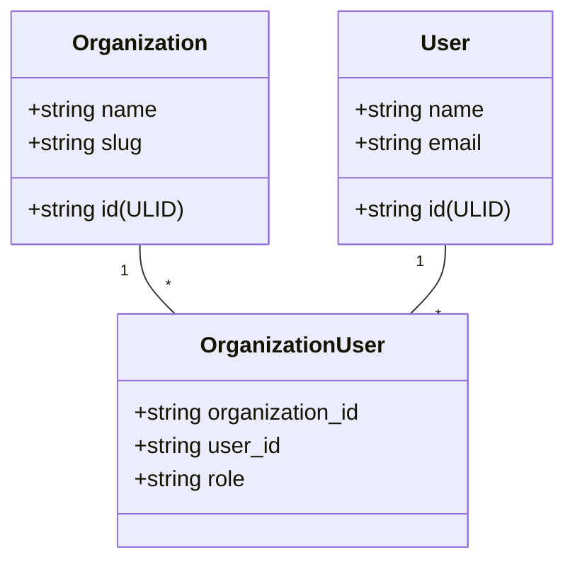
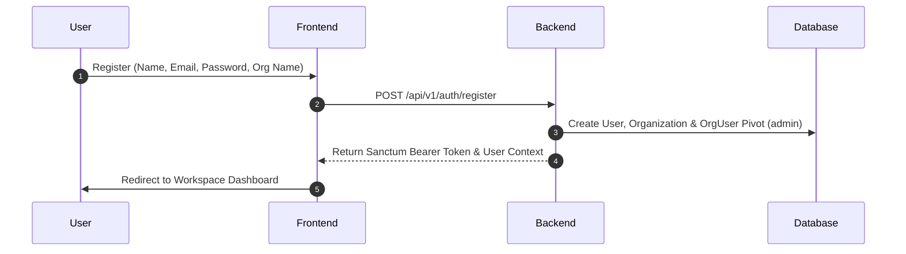
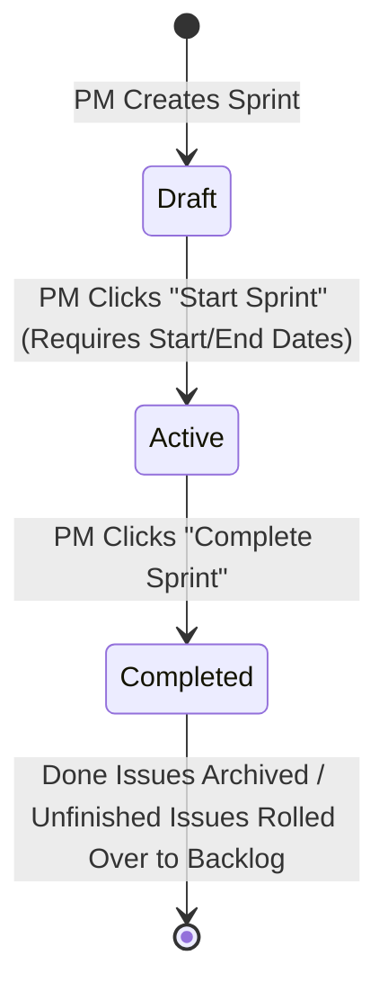
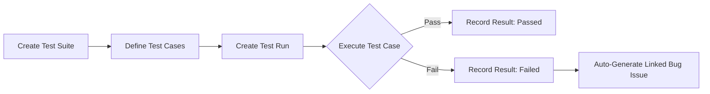
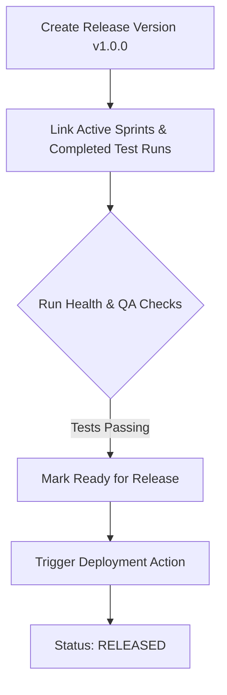

# TASKORA — PROJECT & SYSTEM WORKFLOW DOCUMENTATION

> **Version**: 1.0.0  
> **Target Audience**: Software Engineers, Product Managers, QA Leads, Database Administrators, DevOps Teams  
> **Repository**: [https://github.com/sachu25/taskora.git](https://github.com/sachu25/taskora.git)  

---

## 1. Executive Summary & Product Architecture

**Taskora** is a production-grade, multi-tenant SaaS application designed for end-to-end software development lifecycle (SDLC) management. It unifies **Agile/Scrum Project Management**, **QA & Test Management**, **Kanban Execution**, **Release Management**, and **Audit Activity Logging** into a single cohesive workspace.



### Technology Stack Overview

| Layer | Technology | Purpose / Highlights |
| :--- | :--- | :--- |
| **Backend Framework** | Laravel 11.x (PHP 8.2+) | RESTful API, ULID Primary Keys, Eloquent ORM, Sanctum Auth |
| **Frontend Framework** | React 19 / TypeScript | SPA Architecture, Vite Build System, React Query v5 |
| **Styling & Design System** | Tailwind CSS v4 & Vanilla CSS | Dynamic Dark/Light Mode Theme Provider, High-Contrast UI |
| **Database** | MySQL 8.0+ | Relational Multi-Tenant Data Store, Foreign Key Constraints |
| **Icons & Media** | Lucide React Icons | Vector UI Iconography & Brand Logo Assets |

---

## 2. Multi-Tenant Architecture & Security Model

Taskora uses a **Single Database, Column-Based Tenant Isolation** pattern. Every data record (Projects, Issues, Sprints, Test Suites, Releases, Notifications, Activity Logs) is strictly bound to an `organization_id`.



### Role-Based Access Control (RBAC) Hierarchy

| Role | Scope & Permissions |
| :--- | :--- |
| **`organization_admin`** | Full Organization Control: Member Invitations, Role Management, Team Setup, Project Creation, Release Deployment. |
| **`project_manager`** | Full Project Scope: Backlog Grooming, Sprint Activation/Completion, Team Assignment, Release Planning. |
| **`developer`** | Issue Execution: Status Drag & Drop, Commenting, Log Work, Link Pull Requests. |
| **`tester`** | QA Scope: Test Suite Creation, Test Case Execution, Bug Reporting, Verification. |
| **`reporter`** | Read & Report: Create Issues/Bugs, View Dashboards, Track Progress. |

---

## 3. End-to-End System Workflows

### Workflow 1: User Onboarding & Organization Setup



---

### Workflow 2: Agile & Sprint Management Lifecycle



1. **Backlog Grooming**: Issues created in project backlog with priority (`low`, `medium`, `high`, `urgent`) and type (`story`, `task`, `bug`).
2. **Sprint Planning**: Issues assigned to a Sprint draft. Total story points and issue counts are calculated automatically.
3. **Active Execution**: Only **1 Active Sprint** allowed per project at any given time.
4. **Sprint Rollover**: Completing a sprint moves completed issues to history and automatically rolls unfinished issues back to the backlog or next sprint.

---

### Workflow 3: QA & Test Execution Engine



---

### Workflow 4: Release & Deployment Lifecycle



---

## 4. Local Development Setup Guide

### Prerequisites
- **PHP**: `^8.2` (with PDO, OpenSSL, mbstring, curl extensions enabled)
- **Composer**: `^2.5`
- **Node.js**: `^18.0` or `^20.0` & **npm**: `^9.0`
- **MySQL Server**: `^8.0` (Running via WAMP, XAMPP, or standalone MySQL)

---

### Step-by-Step Installation

#### 1. Clone & Environment Setup
```bash
git clone https://github.com/sachu25/taskora.git
cd taskora
```

#### 2. Backend Setup (Laravel API)
```bash
# Install PHP dependencies
composer install

# Environment File Configuration
cp .env.example .env

# Generate Application Key
php artisan key:generate

# Run Database Migrations & Seeders
php artisan migrate:fresh --seed

# Start Laravel Development Server
php artisan serve --port=8000
```

#### 3. Frontend Setup (React / TypeScript SPA)
```bash
# Navigate to frontend directory
cd frontend

# Install Node dependencies
npm install

# Start Vite Development Server
npm run dev
```

---

### Default Demo Logins (Seeded Data)

| Role | Email | Password |
| :--- | :--- | :--- |
| **Organization Admin** | `admin@taskora.io` | `password` |
| **Project Manager** | `pm@taskora.io` | `password` |
| **Developer** | `dev@taskora.io` | `password` |
| **QA Tester** | `tester@taskora.io` | `password` |

---

## 5. Verification & Testing Commands

### Run Backend Test Suite
```bash
php artisan test
```
*Expected Result*: **99 passing tests (267 assertions)**.

### Run Frontend Production Build
```bash
cd frontend
npm run build
```
*Expected Result*: Clean build with **0 TypeScript errors**.

---

## 6. Directory Structure Reference

```text
Taskora/
├── app/
│   ├── Http/
│   │   ├── Controllers/Api/V1/   # REST API Controllers (Auth, Projects, Sprints, QA, Releases)
│   │   └── Middleware/           # Tenant Context & Sanctum Middleware
│   ├── Models/                   # Eloquent Models (ULID primary keys & Org scoping)
│   ├── Policies/                 # Authorization Policies for Tenant Security
│   └── Services/                 # Business Logic (SprintEngine, QAEngine, ReleaseService)
├── database/
│   ├── migrations/               # Relational Schema Definitions
│   └── seeders/                  # Database Seeders for Demo Workspaces
├── docs/                         # Project Audit Reports & Workflow Docs
├── frontend/
│   ├── src/
│   │   ├── app/providers/        # Auth & Theme (Dark/Light) Context Providers
│   │   ├── components/           # UI Component Library (Buttons, Badges, Modals, Topbar, Sidebar)
│   │   ├── pages/                # Workspace Views (Dashboard, Sprints, Kanban, QA, Releases)
│   │   └── services/             # Axios API Client & Endpoint Services
│   └── public/                   # Official Taskora Brand Logo Assets
└── routes/
    └── api.php                   # Versioned REST API Endpoint Routes (/api/v1)
```

---

## 7. Summary for Team Members

- **Dark & Light Mode**: Toggled via Sun/Moon icon in the topbar or sidebar; styles are managed via CSS variables and `html.light` in [`frontend/src/index.css`](file:///c:/wamp64/www/Taskora/frontend/src/index.css).
- **Brand Assets**: Sliced logos are stored in `frontend/public/` (`taskora-logo-dark.png`, `taskora-logo-light.png`, `taskora-symbol-dark.png`, `taskora-symbol-light.png`).
- **REST API Scoping**: Always pass headers with `Authorization: Bearer <token>`. Endpoints automatically enforce tenant boundary checks based on the authenticated user's active organization.
